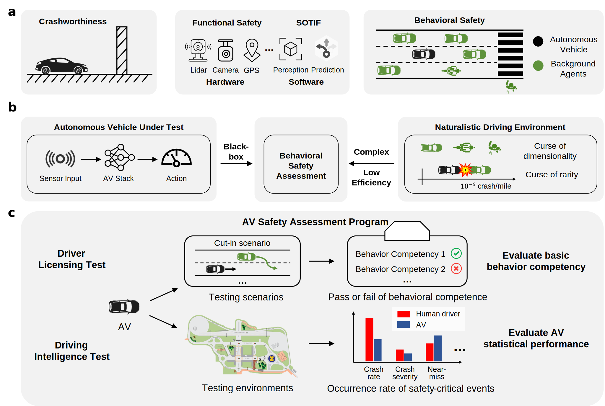

# Behavioral Safety Assessment

[](https://www.python.org/downloads/release/python-3100/)
[](https://releases.ubuntu.com/22.04/)
[](https://docs.ros.org/en/humble/index.html)

### [Paper](https://arxiv.org/abs/2505.16214) | [Supplementary Materials](https://drive.google.com/file/d/1tPDKx9R1yop7VmyoG4YFLEGDdOJkRFb4/view?usp=sharing)

## Introduction

This project contains the source code for the paper titled "Behavioral Safety Assessment towards Large-scale Deployment of Autonomous Vehicles". It includes the Driver Licensing Test (DLT) and Driving Intelligence Test (DIT), utilizing the open-source autonomous driving software stack, Autoware Universe.



## Code structure

```
Behavioral-Safety-Assessment
|- Driver-Licensing-Test: source code and analysis for the Driver Licensing Test.
|- Driving-Intelligence-Test: source code and analysis for the Driving Intelligence Test.
|- Source Code: Source code for package dependencies including TeraSim, TeraSim-Cosim, and Terasim-NDE-ITE.
|- terasim-2024.9.25.1332-py3-none-any.whl: python wheel file for Terasim package quick installation.
|- terasim_cosim-2.0-py3-none-any.whl: python wheel file for Terasim-Cosim package quick installation.
|- terasim_nde_nade-2025.4.27.1659-py3-none-any.whl: python wheel file for Terasim-NDE-ITE package quick installation.
|- terasim-cosim.yaml: conda create environment configuration file.
|- figure: demonstration images and videos.
|- README.md
|- LICENSE.txt
```

## Installation

If you encounter any error, check the [Troubleshooting](#troubleshooting) section for common issues and solutions.

### Requirements

- __Hardware__: CPU with at least 16 cores and a dedicated GPU with at least 8 GB of memory.
- __System__: Ubuntu 22.04 (For optimal performance and stability, we recommend installing on a dedicated machine rather than a virtual machine or Windows Subsystem for Linux).
- __Python__: 3.10 (native to Ubuntu 22.04).


### Dependency Installation

- __Redis__: follow the instructions to install [Redis](https://redis.io/docs/latest/operate/oss_and_stack/install/install-redis/install-redis-on-linux/).

- __Anaconda__: download and install [Anaconda](https://www.anaconda.com/download/success).

- __Autoware__: Follow the installation instructions for the mcity-dedicated version of [Autoware](https://github.com/michigan-traffic-lab/autoware) until you can successfully run the provided short demonstration. This step typically takes 2–4 hours. *If you prefer a quick overview of the tests using the default SUMO controller or plan to integrate your own AV stack later, you may skip this section along with all subsequent Autoware-related sections*.


### Clone the Repository
```bash
git clone https://github.com/michigan-traffic-lab/Behavioral-Safety-Assessment.git
```

### Setup a Virtual Environment

For convenience, we've packaged everything into Python wheel files and simplified the virtual environment setup into a single command, provided below. Installation typically takes about 5–10 minutes. If you'd like to review the source code, check the `Source Code` folder.

```
# Create a virtual environment
conda env create -f terasim-cosim.yaml

# Activate the virtual environment
conda activate terasim-cosim
```


### Setup Redis Server
Set up a Redis server as an in-memory data structure store and leave it running in the background.

```
redis-server
```

To ensure that no residual data affects the current experiment, we recommend flushing the Redis database before each test run. Open a terminal, type `redis-cli` to access the Redis command-line interface (you should see `127.0.0.1:6379>`), then type `flushall` and press Enter to clear all data.


## Run Driver Licensing Test

This video demonstrates the Driver Licensing Test conducted with a Tesla Model 3 and the [Humanetics](https://www.humaneticsgroup.com/products/active-safety-test-systems) platform at the Mcity testing facility. For detailed instructions on data calibration and scenario generation, please refer to the [Driver Licensing Test README](Driver-Licensing-Test/README.md).


To run the DLT with Autoware Universe, you need to open three seperate terminals. For scenario selection, choose from the following options: 

**[car_following, cut_in, lane_departure_opposite, lane_departure_same, left_turn_straight, left_turn_turn, right_turn_straight, right_turn_turn, roundabout_av_inside, roundabout_av_outside, traffic_signal, vehicle_encroachment, vru_at_crosswalk, vru_without_crosswalk]**.

**Terminal 1 (Autoware only)**: This launches the Autoware software stack. Depending on your hardware specifications, initialization may take between 30 and 90 seconds. Wait until Autoware is fully launched before proceeding to the next step.

```bash
ros2 launch autoware_launch planning_simulator.launch.xml map_path:=$HOME/autoware/map vehicle_model:=sample_vehicle sensor_model:=sample_sensor_kit lanelet2_map_file:=lanelet2_mcity_v43.osm
```

**Terminal 2 (Autoware only)**: This initializes an autonomous vehicle in Autoware and starts the co-simulation with TeraSim. If you encounter ModuleNotFoundError: No module named 'terasim_cosim', refer to the Troubleshooting section.

```bash
ros2 launch mcity_abc mcity_abc.launch.py scenario:="car_following"
```

**Terminal 3 (main)**: This starts the main program for the Driver Licensing Test. You may specify the testing scenario, case number, and round number (optional). Add the --gui flag to enable the SUMO interface. 

If using Autoware, all background vehicles should appear in rviz. Then, click **Auto** from the **AutowareStatePanel** on the left bottom of the screen to start driving the vehicle.

If using the default IDM SUMO controller, simply let the program run— the autonomous vehicle will operate on its own without any additional input.

```bash
cd Driver-Licensing-Test

python3 DLT.py --gui --scenario "car_following" --case-num 0 --round-num 1
```

The result will be stored in the `output` folder from the Driver-Licensing-Test directory.


## Run Driving Intelligence Test

This video demonstrates the Driving Intelligence Test simulation conducted with Autoware and CARLA, utilizing the Mcity digital twin environment.


To run the DIT with Autoware Universe, you need to open three seperate terminals.

**Terminal 1 (Autoware only)**: This launches the Autoware software stack. Depending on your hardware specifications, initialization may take between 30 and 90 seconds. Wait until Autoware is fully launched before proceeding to the next step.

```bash
ros2 launch autoware_launch planning_simulator.launch.xml map_path:=$HOME/autoware/map vehicle_model:=sample_vehicle sensor_model:=sample_sensor_kit lanelet2_map_file:=lanelet2_mcity_v43.osm
```

**Terminal 2 (Autoware only)**: This initializes an autonomous vehicle in Autoware and starts the co-simulation with TeraSim. If you encounter ModuleNotFoundError: No module named 'terasim_cosim', refer to the Troubleshooting section.

```bash
ros2 launch mcity_demo cosim.launch.py
```

**Terminal 3 (main)**: This starts the main program for the Driving Intelligence Test. You may customize the output directories or use the default settings. Add the --gui flag to enable the SUMO interface. 

If using Autoware, all background vehicles should appear in rviz. Then, click **Auto** from the **AutowareStatePanel** on the left bottom of the screen to start driving the vehicle.

If using the default IDM SUMO controller, simply let the program run— the autonomous vehicle will operate on its own without any additional input.

```
cd Driving-Intelligence-Test

python3 DIT.py --gui --dir "output" --name "test_run" --nth "0" --aggregateddir "aggregated"
```

The result will be stored in the `output` folder from the Driving-Ingelligence-Test directory.


## Troubleshooting

**1. ModuleNotFoundError: No module named 'terasim_cosim'**

This issue occurs because the ROS 2 system uses the system default Python interpreter rather than the Anaconda environment. To resolve this, first deactivate the Anaconda environment to return to the system Python, then manually install the terasim-cosim package:

```bash
# Deactivate conda environments until you're back to the system Python
conda deactivate 

# Manually install the terasim-cosim package
pip install terasim_cosim-2.0-py3-none-any.whl
```

**2. SUMO GUI not displaying**
```bash
libGL error: failed to load driver: swrast
X Error: code 2 major 152 minor 3: BadValue (integer parameter out of range for operation)
```
You can resolve this issue by running the following command
```bash
conda install -c conda-forge libstdcxx-ng
```

**3. Redis server creation error**
``` 
"_Could not create server TCP listening socket *:6379: bind: Address already in use_",
```
That means the Redis server is already running, and you can proceed without further action.

**4. CAV route error**
```
libsumo.libsumo.TraCIException: Invalid route 'AV_route' for vehicle 'CAV'.
Error: Another vehicle type (or distribution) with the id 'AV' exists.
Quitting (on error).
```
This issue may occur when running a scenario from the Driver Licensing Test for the first time. Restarting the scenario once will resolve the issue.


## Developer

- Haowei Sun: haoweis@umich.edu

- Tinghan Wang: tinghanw@umich.edu

- Zhijie Qiao zhijieq@umich.edu

- Haojie Zhu: zhuhj@umich.edu

- Xintao Yan: xintaoy@umich.edu

- Sean Shen: shengyin@umich.edu

## License

This project is licensed under the [PolyForm Noncommercial License 1.0.0](LICENSE.txt).

## Contact

- Henry Liu: henryliu@umich.edu
